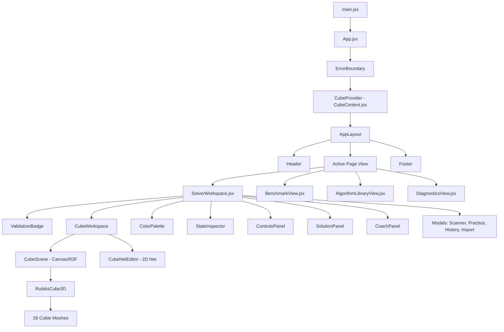
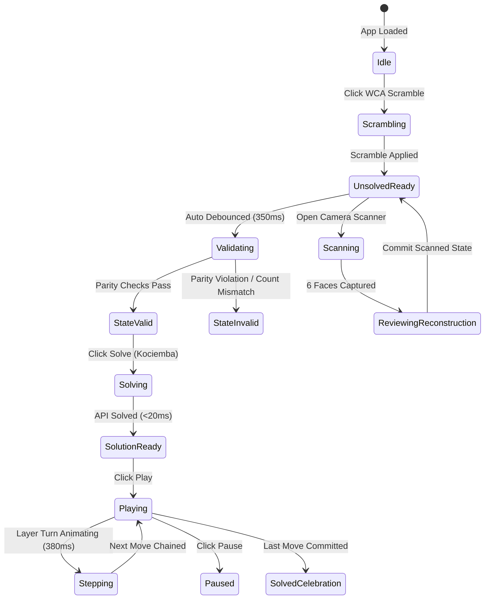

# CubeMind Frontend Architecture & UI/UX Redesign Audit
**Role:** Lead Frontend Architect & Senior Product Designer  
**Target Design Paradigm:** *Cinematic Intelligence* (Linear × Apple × Vercel × High-End 3D Engineering Workspaces)  
**Status:** AUDIT ONLY (Zero source modification, zero package alteration, zero backend/test disturbance)

---

## A. Executive Summary

CubeMind is an advanced Rubik's Cube intelligence platform with a fully functional computational core: Kociemba Two-Phase solving, mathematical parity validation, full deterministic move simulation, WebGL 3D cube rendering, client-side computer vision scanning with multi-factor confidence scoring, AI coaching, practice stopwatch drills, and local session analytics.

While the underlying logic, state machines, and mathematical engines are robust (126 unit/integration tests passing across 23 test suites), the current frontend user interface presents significant aesthetic and architectural ceilings:
1. **Visual Hierarchy & Layout Clutter:** The current layout relies on standard stacked cards with harsh borders (`border-slate-800`), bright generic glowing cards, and dense information scattering. It lacks the spatial poise, subtle depth gradients, and optical precision of elite developer platforms (e.g., Linear, Apple developer tools, Vercel).
2. **3D Experience Underutilization:** The 3D Three.js/R3F viewport is rendered inside a static fixed-height card without ambient studio lighting, shadow planes, subtle floating physics, cinematic idle motion, or smooth focal transitions.
3. **State & Re-render Monolith:** A single context (`CubeContext.jsx`) holds 30+ reactive states—mixing high-frequency animation frames, real-time stopwatch ticks, deep validation status, CV frame captures, and solver metrics in one tree, causing widespread unnecessary component re-renders.
4. **Disjointed Modals & Workspaces:** High-value workflows (Camera Scanner, Practice Drills, History, State Importer) live in isolated modal popups rather than cohesive, immersive workspace modes.
5. **Styling Inconsistencies & Legacy Artifacts:** Leftover Vite scaffolding (`App.css`), Tailwind v4 setup with minimal tokenization, and manual CSS class stitching create visual fragility.

**Transformation Vision:** Transform CubeMind into a **Cinematic Intelligence Workspace** featuring dark navy/obsidian foundations, precision cyan/violet accents, real-time reactive telemetry, glass-surfaced depth hierarchy, studio-grade 3D lighting with physics-eased rotations, and streamlined workspace layouts.

---

## B. Current Frontend Architecture



### Architectural Details:
- **Framework:** React 19.2.8 (`react`, `react-dom`)
- **Build System:** Vite 8.2.0 with `@vitejs/plugin-react` and `@tailwindcss/vite`
- **Language Level:** JavaScript (ES modules, JSX) with modern ES2023+ syntax
- **Entry Points:** `frontend/index.html` $\rightarrow$ `src/main.jsx` $\rightarrow$ `src/App.jsx`
- **Routing:** Tab-based state routing controlled via `activeTab` ('workspace' | 'benchmark' | 'algorithms' | 'diagnostics') inside `CubeContext`. No external router (e.g., React Router) is installed or needed.
- **Client-Side Storage:** Browser `localStorage` for solve records, practice logs, and telemetry (`src/utils/sessionHistory.js`).

---

## C. Current Dependency Stack

### Installed Dependencies (`package.json` Audit):
| Dependency | Version | Type | Status / Evaluation |
|---|---|---|---|
| `react` | `^19.2.8` | Production | Core UI Library (React 19 RC/Stable) |
| `react-dom` | `^19.2.8` | Production | Core DOM Renderer |
| `three` | `^0.185.1` | Production | 3D Graphics Engine (Latest) |
| `@react-three/fiber` | `^9.7.0` | Production | React renderer for Three.js (R3F v9) |
| `@react-three/drei` | `^10.7.8` | Production | R3F Helper suite (OrbitControls, PerspectiveCamera, Center) |
| `lucide-react` | `^1.33.0` | DevDependency | Vector Icon Library (rich icon set) |
| `tailwindcss` | `^4.3.3` | DevDependency | Utility CSS Framework (Tailwind v4) |
| `@tailwindcss/vite` | `^4.3.3` | DevDependency | Official Vite plugin for Tailwind v4 |
| `vite` | `^8.2.0` | DevDependency | Lightning-fast ESM bundler & dev server |
| `vitest` | `^4.1.11` | DevDependency | Unit/integration test runner |
| `jsdom` | `^30.0.1` | DevDependency | Headless browser DOM environment for testing |
| `@testing-library/react` | `^16.3.2` | DevDependency | React Component Testing Harness |
| `@testing-library/jest-dom` | `^7.0.1` | DevDependency | Custom DOM matchers |
| `oxlint` | `^1.75.0` | DevDependency | Rust-based ultra-fast linter |

### Missing Packages from Target Spec:
- **TypeScript:** Not currently configured (pure JS/JSX).
- **Framer Motion / Motion:** Not installed (animations currently use CSS transitions + custom R3F `useFrame`).
- **shadcn/ui / Radix UI:** Not installed (custom primitive components exist in `src/components/common/`).
- **Recharts:** Not installed (charts in Benchmark and Solution Analytics currently use bespoke HTML/CSS bars).
- **Zustand:** Not installed (single unified React Context `CubeContext.jsx`).

---

## D. Current Component Architecture

### 1. Root & Layout Layer
- [main.jsx](file:///c:/Users/Dell/.cursor/Second-Self/Rubix%20Solver/frontend/src/main.jsx): React StrictMode root mount.
- [App.jsx](file:///c:/Users/Dell/.cursor/Second-Self/Rubix%20Solver/frontend/src/App.jsx): ErrorBoundary + CubeProvider + AppContent layout switcher.
- [AppLayout.jsx](file:///c:/Users/Dell/.cursor/Second-Self/Rubix%20Solver/frontend/src/components/layout/AppLayout.jsx): Shell wrapper with ambient background radial gradients, sticky header, responsive main slot, and footer.
- [Header.jsx](file:///c:/Users/Dell/.cursor/Second-Self/Rubix%20Solver/frontend/src/components/layout/Header.jsx): Logo, Phase 4A badge, desktop & mobile navigation pills, backend health heartbeat pill.
- [Footer.jsx](file:///c:/Users/Dell/.cursor/Second-Self/Rubix%20Solver/frontend/src/components/layout/Footer.jsx): System status, engine specifications, WCAWestern notation reference.

### 2. Common UI Primitives (`src/components/common/`)
- [Button.jsx](file:///c:/Users/Dell/.cursor/Second-Self/Rubix%20Solver/frontend/src/components/common/Button.jsx): Variants (`primary`, `secondary`, `outline`, `danger`, `success`, `ghost`), sizes (`sm`, `md`, `lg`), loading spinner.
- [Badge.jsx](file:///c:/Users/Dell/.cursor/Second-Self/Rubix%20Solver/frontend/src/components/common/Badge.jsx): Variants (`neutral`, `success`, `warning`, `error`, `info`, `indigo`), pulsing indicator dots.
- [Card.jsx](file:///c:/Users/Dell/.cursor/Second-Self/Rubix%20Solver/frontend/src/components/common/Card.jsx): Glassmorphism surface container with header icon, title, subtitle, action slot, and optional glowing border.
- [EmptyState.jsx](file:///c:/Users/Dell/.cursor/Second-Self/Rubix%20Solver/frontend/src/components/common/EmptyState.jsx): Dashed border placeholder container.
- [ErrorState.jsx](file:///c:/Users/Dell/.cursor/Second-Self/Rubix%20Solver/frontend/src/components/common/ErrorState.jsx): Error callout with retry trigger.
- [LoadingSpinner.jsx](file:///c:/Users/Dell/.cursor/Second-Self/Rubix%20Solver/frontend/src/components/common/LoadingSpinner.jsx): Animated dual-ring loader.
- [ErrorBoundary.jsx](file:///c:/Users/Dell/.cursor/Second-Self/Rubix%20Solver/frontend/src/components/common/ErrorBoundary.jsx): Class-based error boundary preventing UI crashes.

### 3. 3D Visualization Layer (`src/components/3d/`)
- [CubeScene.jsx](file:///c:/Users/Dell/.cursor/Second-Self/Rubix%20Solver/frontend/src/components/3d/CubeScene.jsx): R3F Canvas container with OrbitControls, WebGL error boundary, 7 camera view presets (Isometric, F, U, R, B, D, L), reset camera trigger, and sticker hover badges.
- [RubiksCube3D.jsx](file:///c:/Users/Dell/.cursor/Second-Self/Rubix%20Solver/frontend/src/components/3d/RubiksCube3D.jsx): Core 3D coordinator. Segregates 26 cubies into static vs. rotating layer groups based on active move animation; animates rotation angle using cubic ease-in-out curve in `useFrame`.
- [Cubie.jsx](file:///c:/Users/Dell/.cursor/Second-Self/Rubix%20Solver/frontend/src/components/3d/Cubie.jsx): 3D Mesh for individual cubie with BoxGeometry (`0.94` scale for realistic sticker grooves), dynamic StandardMaterial caching, emissive hover/selection glow, pointer raycasting.

### 4. Workspace Components (`src/components/workspace/`)
- [CubeWorkspace.jsx](file:///c:/Users/Dell/.cursor/Second-Self/Rubix%20Solver/frontend/src/components/workspace/CubeWorkspace.jsx): Viewport manager offering 3 view modes: 3D Canvas, 2D Net, and Split View (3D + 2D side-by-side).
- [CubeNetEditor.jsx](file:///c:/Users/Dell/.cursor/Second-Self/Rubix%20Solver/frontend/src/components/workspace/CubeNetEditor.jsx): 2D unfolded cross net (U / L-F-R-B / D) for sticker clicking, index inspection, and fixed center locks.
- [ColorPalette.jsx](file:///c:/Users/Dell/.cursor/Second-Self/Rubix%20Solver/frontend/src/components/workspace/ColorPalette.jsx): 6 WCA color swatches with dynamic 9/9 count badges, undo/redo (Ctrl+Z / Ctrl+Y), keyboard hotkeys (1-6 / U,R,F,D,L,B), reset, and paste import trigger.
- [ValidationBadge.jsx](file:///c:/Users/Dell/.cursor/Second-Self/Rubix%20Solver/frontend/src/components/workspace/ValidationBadge.jsx): Real-time mathematical checklist banner verifying 54-facelet count, color distribution, fixed centers, physical orbits, and parity invariants.
- [ControlsPanel.jsx](file:///c:/Users/Dell/.cursor/Second-Self/Rubix%20Solver/frontend/src/components/workspace/ControlsPanel.jsx): Action center for WCA 20-move scramble, Kociemba solve trigger, practice mode launcher, camera scanner launcher, and 6 algorithm presets.
- [SolutionPanel.jsx](file:///c:/Users/Dell/.cursor/Second-Self/Rubix%20Solver/frontend/src/components/workspace/SolutionPanel.jsx): Solution viewer with move count, solve time (ms), progress percentage, interactive clickable move timeline, play/pause, prev/next step buttons, speed selector (0.5x to 2.0x), and copy moves.
- [CoachPanel.jsx](file:///c:/Users/Dell/.cursor/Second-Self/Rubix%20Solver/frontend/src/components/workspace/CoachPanel.jsx): AI Solution Coach synchronized with 3D playback. Provides step-by-step physical turn instructions, finger trick grip advice, pattern recognition, and mode toggle (Beginner vs. Compact).
- [StateInspector.jsx](file:///c:/Users/Dell/.cursor/Second-Self/Rubix%20Solver/frontend/src/components/workspace/StateInspector.jsx): Raw 54-character state string serializer with copy action and sticker distribution breakdown.
- [PracticeModal.jsx](file:///c:/Users/Dell/.cursor/Second-Self/Rubix%20Solver/frontend/src/components/workspace/PracticeModal.jsx): Fullscreen modal drill for tactile practice with stopwatch, spacebar/enter confirmations, pace metrics (sec/move), and history persistence.
- [SessionHistoryModal.jsx](file:///c:/Users/Dell/.cursor/Second-Self/Rubix%20Solver/frontend/src/components/workspace/SessionHistoryModal.jsx): Modal viewing solve records and practice drills with timestamps, move counts, solve times, and clear options.
- [StateImportModal.jsx](file:///c:/Users/Dell/.cursor/Second-Self/Rubix%20Solver/frontend/src/components/workspace/StateImportModal.jsx): Modal for pasting 54-char URFDLB strings with instant validation and quick presets (Solved, Checkerboard, Superflip).

### 5. Computer Vision Scanner Components (`src/components/scanner/`)
- [CubeScannerModal.jsx](file:///c:/Users/Dell/.cursor/Second-Self/Rubix%20Solver/frontend/src/components/scanner/CubeScannerModal.jsx): Camera modal handling stream permissions, hardware switching (front/rear), shutter capture, frame extraction, and pipeline dispatch.
- [ScanOverlayGuide.jsx](file:///c:/Users/Dell/.cursor/Second-Self/Rubix%20Solver/frontend/src/components/scanner/ScanOverlayGuide.jsx): 3x3 HUD reticle overlay with target face orientation and center sticker alignment cues.
- [ScanFaceProgress.jsx](file:///c:/Users/Dell/.cursor/Second-Self/Rubix%20Solver/frontend/src/components/scanner/ScanFaceProgress.jsx): 6-face step progress bar (U $\rightarrow$ R $\rightarrow$ F $\rightarrow$ D $\rightarrow$ L $\rightarrow$ B).
- [DetectedFacePreview.jsx](file:///c:/Users/Dell/.cursor/Second-Self/Rubix%20Solver/frontend/src/components/scanner/DetectedFacePreview.jsx): Single-face CV inspection card showing sampled sticker swatches, quality metrics (blur, brightness, saturation), confidence score, and Accept/Retake buttons.
- [ScanReconstructionReview.jsx](file:///c:/Users/Dell/.cursor/Second-Self/Rubix%20Solver/frontend/src/components/scanner/ScanReconstructionReview.jsx): 6-face full reconstruction review net with ambiguity highlighting, manual correction color tools, per-face rescan triggers, and direct commit to solver.

### 6. Pages Layer (`src/pages/`)
- [SolverWorkspace.jsx](file:///c:/Users/Dell/.cursor/Second-Self/Rubix%20Solver/frontend/src/pages/SolverWorkspace.jsx): Primary 12-column split layout (7 cols visualizer/editor, 5 cols controls/solution/coach).
- [BenchmarkView.jsx](file:///c:/Users/Dell/.cursor/Second-Self/Rubix%20Solver/frontend/src/pages/BenchmarkView.jsx): Live throughput lab running batch solves across short (len=5), medium (len=12), and long WCA (len=20) scrambles with KPI aggregations.
- [AlgorithmLibraryView.jsx](file:///c:/Users/Dell/.cursor/Second-Self/Rubix%20Solver/frontend/src/pages/AlgorithmLibraryView.jsx): Speedsolving algorithm catalog (Sexy Move, Sune, T-Perm, J-Perm, Superflip, Checkerboard) with copy and load triggers.
- [DiagnosticsView.jsx](file:///c:/Users/Dell/.cursor/Second-Self/Rubix%20Solver/frontend/src/pages/DiagnosticsView.jsx): Architecture verification view polling `/` API health and displaying live JSON diagnostic payloads.

---

## E. Current Styling Architecture

### CSS Architecture Analysis
- **Framework:** Tailwind CSS v4 (`@tailwindcss/vite` + `@import "tailwindcss";` in `src/index.css`).
- **Color Variables Defined in `:root`:**
  - `--color-cube-u: #f8fafc;` (White)
  - `--color-cube-r: #ef4444;` (Red)
  - `--color-cube-f: #22c55e;` (Green)
  - `--color-cube-d: #eab308;` (Yellow)
  - `--color-cube-l: #f97316;` (Orange)
  - `--color-cube-b: #3b82f6;` (Blue)
- **Custom Utilities in `index.css`:**
  - `.glass-panel`: `background: rgba(15, 23, 42, 0.75); backdrop-filter: blur(16px); border: 1px solid rgba(255, 255, 255, 0.08);`
  - `.glass-panel-interactive`: Hover state with `border-color: rgba(99, 102, 241, 0.4)`.
  - `.glow-cyan`, `.glow-indigo`, `.glow-emerald`: Colored drop shadows.
  - Custom dark scrollbars.
- **Dead Code Detected:** `src/App.css` contains 185 lines of legacy Vite template styles (e.g. `.hero`, `.vite`, `.counter`, `#next-steps`) that are not imported anywhere.

---

## F. Current 3D Architecture

### 1. Scene Pipeline
- **Canvas Provider:** `@react-three/fiber` `Canvas` rendered with `camera={{ position: [3.8, 3.2, 4.5], fov: 42 }}` and `gl={{ antialias: true, alpha: true }}`.
- **Camera Controls:** `@react-three/drei` `OrbitControls` with `enableDamping`, `dampingFactor={0.06}`, `minDistance={3.2}`, `maxDistance={14.0}`.
- **Lighting:**
  - Ambient light: intensity `0.85`
  - Key Directional light: position `[10, 15, 12]`, intensity `1.4`, `castShadow`
  - Fill Directional light: position `[-10, -12, -8]`, intensity `0.6`
  - Top Point light: position `[0, 10, 0]`, intensity `0.5`
- **Center Helper:** `<Center>` wrapping the cube group.

### 2. Mesh & Geometry Architecture
- **26 Cubies:** Cubes of size `0.94 × 0.94 × 0.94` positioned at coordinates $x, y, z \in \{-1, 0, 1\}$ (skipping internal core $(0,0,0)$).
- **Materials:** `THREE.MeshStandardMaterial` cached by color + selection + hover state in a global Map `materialsCache`.
  - Face colors: 6 materials per mesh mapped to Three.js BoxGeometry face order `[+X, -X, +Y, -Y, +Z, -Z]`.
  - Inner faces: `#111827` (roughness 0.85, metalness 0.05).
  - Outer stickers: Western colors (roughness 0.25, metalness 0.15).
  - Emissive highlights: `#38bdf8` for selected, `#ffffff` for hovered.

### 3. Layer Animation Architecture
- Rotation is computed in `RubiksCube3D.jsx` using `useFrame`.
- For any active move (e.g., $R, U', F2$), the 26 cubies are partitioned into:
  1. `staticCubies`: 17 unaffected cubies kept in a stationary `<group>`.
  2. `rotatingCubies`: 9 affected cubies placed in an animated `<group ref={layerGroupRef}>`.
- The group rotation is interpolated from $0$ to `targetAngle` using `easeInOutCubic(t)` over `durationMs` (default 380ms).
- When progress reaches $1.0$, `onAnimationComplete` is triggered:
  - Canonical 54-char `stateString` in `CubeContext` is updated with the transformed state.
  - The rotating layer group rotation is instantly reset to $(0,0,0)$.
  - If playback is active (`PLAYING`), the next move animation in the timeline is immediately queued.

---

## G. Current Animation Architecture

1. **3D Layer Turns:** Pure R3F frame loop (`useFrame`) interpolating Euler angles on grouped meshes via `easeInOutCubic`.
2. **UI Transitions:** Tailwind CSS class-based transitions (`transition-all duration-200`, `transition-colors`).
3. **Pulsing Indicators:** Tailwind `animate-pulse` and `animate-spin` on loading icons and status dots.
4. **Shutter Flash:** CSS keyframe `animate-out fade-out duration-300` in the camera scanner.
5. **Shortfall:** No physics-based spring animations, layout transitions, exit/enter presence animations, or gesture micro-interactions due to absence of Framer Motion.

---

## H. Current State Management

### Analysis of `CubeContext.jsx`
`CubeContext` is a comprehensive React Context containing:
- **Core Cube State:** `stateString`, `activeScramble`, `scrambleHistory`.
- **Manual State Editing:** `selectedColor`, `selectedStickerIndex`, `editMode`, `history` (undo stack), `future` (redo stack).
- **Validation State:** `validationResult`, `isValidating`.
- **Solver State:** `solutionResult`, `initialSolveState`, `solutionTimeline` (precomputed 54-char string snapshots for every move), `isLoading`, `error`.
- **Playback Controller State Machine:**
  - Statuses: `'IDLE' | 'READY' | 'PLAYING' | 'PAUSED' | 'COMPLETED' | 'ERROR'`
  - `currentStepIndex`, `playbackSpeed`, `activeAnimation`.
- **Global UI State:** `activeTab`, `backendHealth`.

### Re-render Optimization Risk:
Because all these values are passed through a single `contextValue` object without selector subscriptions, **every tick of playback animation or step change triggers re-renders across all consuming components** (`ValidationBadge`, `ColorPalette`, `StateInspector`, `ControlsPanel`, `CoachPanel`).

---

## I. Current Solver UX

1. **Triggering:** User clicks "Scramble Cube (WCA 20)" or enters manual state, then clicks "Solve with Kociemba".
2. **Execution:** Fast backend execution (<15ms via Kociemba Two-Phase IDA*).
3. **Playback:**
   - Interactive Move Sequence ribbon with individual clickable pills.
   - Progress bar showing percentage.
   - Play/Pause toggle with automatic step chaining.
   - Prev/Next step stepping.
   - Speed selector dropdown (`0.5x`, `1.0x`, `1.5x`, `2.0x`).
   - Solution Analytics breakdown showing moves saved by optimizer, face turns distribution, half turns, and prime moves.
   - Synchronized AI Coach panel with physical grip hints and pattern names.

---

## J. Current Camera UX

1. **Workflow:** User clicks "Scan with Camera" in Controls Panel $\rightarrow$ Opens `CubeScannerModal`.
2. **Stream Initialization:** `useCameraStream` queries browser `navigator.mediaDevices.getUserMedia` for environmental rear camera (with front-camera fallback).
3. **Capture & Detection:**
   - 3x3 reticle guide overlay assists user in framing the cube face.
   - User clicks shutter $\rightarrow$ Canvas frame extracted $\rightarrow$ CV pipeline executes in worker/main thread (`processCapturedFace`).
   - Quality assessment evaluates blur, brightness, saturation, and grid estimation confidence.
   - User reviews detected face colors and accepts or retakes.
4. **6-Face Sequence:** Progresses through standard order $U \rightarrow R \rightarrow F \rightarrow D \rightarrow L \rightarrow B$.
5. **Reconstruction Review:** Once all 6 faces are captured, `ScanReconstructionReview` presents the complete unfolded 2D net, highlights ambiguous stickers, allows direct manual color correction, and verifies $9/9$ counts before committing to the main solver workspace.

---

## K. Current Responsive Design

- **Desktop ($\ge 1024\text{px}$):** 12-column grid (`7 cols` left for 3D/Net workspace + `5 cols` right for controls/solutions/coach).
- **Tablet ($768\text{px} - 1023\text{px}$):** Single column stacked layout.
- **Mobile ($< 768\text{px}$):**
  - Header switches to horizontal scrollable navigation bar.
  - 3D viewport height reduces from $460\text{px}$ to $400\text{px}$.
  - Color palette shifts to 3-column grid.
  - Modals adapt to near fullscreen (`max-w-full`, `max-h-[92vh]`).
- **Shortfall:** On mobile/tablet, the 3D canvas and controls require excessive scrolling; split view is disabled on mobile; move timeline wraps into large tall vertical blocks.

---

## L. Current Accessibility

- **Semantic HTML:** `<header>`, `<main>`, `<footer>`, `<nav>`, `<button>` tags used across the application.
- **ARIA Attributes:** Modals contain `role="dialog"`, `aria-modal="true"`, `aria-labelledby`.
- **Keyboard Shortcuts:**
  - Numbers `1-6` or letters `U, R, F, D, L, B` select palette colors.
  - `Ctrl+Z` / `Cmd+Z` executes Undo; `Ctrl+Shift+Z` / `Cmd+Shift+Z` / `Ctrl+Y` executes Redo.
  - `Space` / `Enter` in Practice Mode confirms move execution.
  - `Escape` closes active modals.
- **Shortfall:** 3D Canvas lacks ARIA live announcements for layer turns; color palette relies heavily on color alone (though letter codes $U, R, F, D, L, B$ are displayed); focus outline styles are subtle and inconsistently visible.

---

## M. Current Testing

- **Harness:** Vitest v4.1.11 with JSDOM environment and `@testing-library/react`.
- **Mock Setup (`setupTests.js`):** Mocks `ResizeObserver`, 2D canvas `getImageData`/`drawImage`, WebGL canvas context, and `toDataURL`.
- **Test Coverage:** **126 tests across 23 test suites — 100% PASSING**.
  - `App.test.jsx` (2 tests)
  - `CoachPanel.test.jsx` (6 tests)
  - `CubeContext.test.jsx` (3 tests)
  - `CubeScannerModal.test.jsx` (5 tests)
  - `ErrorBoundary.test.jsx` (3 tests)
  - `PracticeModal.test.jsx` (3 tests)
  - `SessionHistoryModal.test.jsx` (3 tests)
  - `SolutionPanel.test.jsx` (4 tests)
  - `api.test.js` (5 tests)
  - `cameraStream.test.js` (6 tests)
  - `coachExplainer.test.js` (4 tests)
  - `colorClassification.test.js` (8 tests)
  - `cube3DMapping.test.js` (6 tests)
  - `cubeAnimationMapping.test.js` (5 tests)
  - `cubeMoveEngine.test.js` (9 tests)
  - `cubeUtils.test.js` (6 tests)
  - `cvPipeline.test.js` (17 tests)
  - `manualEditing.test.jsx` (7 tests)
  - `playbackController.test.jsx` (2 tests)
  - `practiceSession.test.js` (5 tests)
  - `scanReconstructionReview.test.jsx` (6 tests)
  - `scanSession.test.js` (4 tests)
  - `sessionHistory.test.js` (7 tests)

---

## N. Current Performance Risks

1. **Monolithic Context Re-renders:** Every update to `currentStepIndex` or `activeAnimation` re-renders all 8 child components consuming `CubeContext`.
2. **Three.js Material Allocations:** While `materialsCache` caches materials, mesh recreation during state shifts can trigger minor garbage collection spikes.
3. **Canvas Animation Overhead:** `useFrame` runs continuously even during idle states if not explicitly paused.
4. **Multiple Three.js Instances Warning:** Vitest console reports `THREE.WARNING: Multiple instances of Three.js being imported` due to simultaneous module bundling between `@react-three/drei` and root `three`.

---

## O. Current UI/UX Problems

| Problem Area | Specific Finding | Severity |
|---|---|---|
| **Visual Hierarchy** | Too many competing glowing boxes, high-contrast borders, and saturated badges causing cognitive overload. | High |
| **3D Stage Prominence** | 3D cube is confined to an ordinary card box without dramatic studio lighting, soft floor reflections, or floating physics. | High |
| **Information Density** | Workspace right column is a long vertical stack of 3 dense cards (Controls, Solutions, AI Coach), pushing content off-screen. | Medium |
| **Move Timeline Interaction** | Move tokens wrap into a blocky grid rather than a sleek, horizontal scrubbing timeline with phase markers (Cross $\rightarrow$ F2L $\rightarrow$ OLL $\rightarrow$ PLL). | High |
| **Modal Fragmentation** | Camera Scanner, Practice Mode, and History exist as abrupt modal overlays instead of cohesive workspace viewports. | Medium |
| **Color & Theme Restraint** | Gradients and glows are overly generic; lack of refined translucent obsidian glassmorphism. | Medium |
| **Benchmark & Diagnostics Polish** | Tables in Benchmark and Diagnostics look like raw developer dump screens rather than executive telemetry dashboards. | Low |

---

## P. Components to Preserve

These components have sound logic, passing tests, and solid structure and should be **preserved as foundation**:
1. `src/components/common/ErrorBoundary.jsx`
2. `src/utils/cubeMoveEngine.js` (Deterministic move transformations)
3. `src/utils/cube3DMapping.js` (3D spatial cubie mapping)
4. `src/utils/cubeAnimationMapping.js` (Layer coordinate and angle definitions)
5. `src/utils/cubeUtils.js` (Validation, facelet parsers, WCA Western definitions)
6. `src/utils/sessionHistory.js` (Local storage persistence)
7. `src/coach/coachExplainer.js` & `coachPatterns.js` (AI coaching logic)
8. `src/cv/*` (Complete CV pipeline, image processing, color classification, and confidence heuristics)
9. `src/services/api.js` (FastAPI backend service client)
10. `src/hooks/*` (`useCameraStream`, `useScanSession`, `usePracticeSession`)

---

## Q. Components to Redesign

These components should undergo a complete visual and structural redesign:
1. **`Header.jsx` & `AppLayout.jsx`:** Transform into an ultra-sleek, floating glass command bar with integrated system status, breadcrumbs, and mode switcher.
2. **`CubeScene.jsx` & `RubiksCube3D.jsx`:** Upgrade to a "Cinematic 3D Stage" with studio environment lighting, contact shadow plane, idle floating dynamics, camera pan transitions, and solve celebration burst.
3. **`SolutionPanel.jsx`:** Redesign into a "Solver Intelligence Console" with horizontal scrubbing move timeline, speed slider, phase breakdown markers, and micro-metrics.
4. **`CoachPanel.jsx`:** Transform from a static card into an "AI Coach HUD" with animated finger-trick vectors, pattern badges, and next-move preview ribbons.
5. **`ControlsPanel.jsx`:** Redesign into a unified "Execution Dock" with tactile action buttons, keyboard shortcut indicators, and streamlined algorithm selector.
6. **`ValidationBadge.jsx`:** Elevate into a "Real-time Parity Sentinel" with animated invariant checks and clean pass/warn/fail telemetry.
7. **`CubeScannerModal.jsx` & `ScanReconstructionReview.jsx`:** Redesign into an "AI Vision Studio" with holographic reticle overlays, real-time lighting feedback gauges, and 3D reconstruction preview.
8. **`BenchmarkView.jsx` & `DiagnosticsView.jsx`:** Re-skin into high-end "Performance Telemetry Labs" with latency distribution graphs and live endpoint ping monitors.

---

## R. Components to Refactor

1. **`CubeContext.jsx`:** Refactor into modular state slices or memoized context providers to decouple high-frequency playback animation ticks from static workspace metadata.
2. **`Cubie.jsx`:** Refactor geometry and materials to use rounded chamfer bevels, metallic edge trim, and optimized instanced/material caching.
3. **`ColorPalette.jsx`:** Refactor into a floating tactile bottom bar or compact tool dock with integrated Undo/Redo/Reset buttons.
4. **`CubeNetEditor.jsx`:** Refactor into an interactive vector SVG or ultra-clean 2.5D net editor with sticker drag-paint capability.

---

## S. Recommended Design System: "Cinematic Intelligence"

### 1. Color System
```
Foundation (Backgrounds & Bases):
- Dark Space / Canvas: #06090F (Ultra-deep obsidian navy)
- Surface Base:        #0C1322 (Deep navy slate)
- Surface Elevated:    #111C33 (Translucent elevated container)
- Surface Overlay:     #162444 (Active hover / modal layer)

Primary Accents (Intelligence & Energy):
- Cyan Primary:        #06B6D4 (Electric Cyan)
- Cyan Glow:           rgba(6, 182, 212, 0.25)
- Cyan Subtle:         #083344

Secondary Accents (Compute & Mastery):
- Violet Secondary:    #8B5CF6 (Precision Violet)
- Indigo Accent:       #6366F1 (Deep Compute Indigo)
- Violet Glow:         rgba(139, 92, 246, 0.20)

System Semantics:
- Success / Validated: #10B981 (Emerald Green)
- Warning / Caution:   #F59E0B (Amber Gold)
- Error / Parity Fail: #EF4444 (Crimson Coral)
- Neutral Text Muted:  #64748B (Slate 500)
- Neutral Text Body:   #94A3B8 (Slate 400)
- Neutral Text Bright: #F1F5F9 (Slate 100)
- Heading / White:     #FFFFFF

Cube Western Color Tokens (High-Fidelity):
- Up (White):          #F8FAFC (Pure Western White)
- Right (Red):         #EF4444 (Racing Red)
- Front (Green):       #22C55E (Signal Emerald Green)
- Down (Yellow):       #EAB308 (Solar Gold)
- Left (Orange):       #F97316 (Vibrant Amber Orange)
- Back (Blue):         #3B82F6 (Precision Cobalt Blue)
- Plastic Body:        #0D1117 (Matte Dark Carbon Plastic)
```

### 2. Typography
- **Display & Hero Numbers:** `font-sans` with tight tracking (`-0.03em`), bold weight (700/800).
- **Headings (H1-H4):** Modern geometric sans (`Inter`, `system-ui`, `-apple-system`), crisp letter-spacing (`-0.02em`).
- **Body:** Neutral slate text with $1.5$ line-height for effortless readability.
- **Metadata & Telemetry:** `font-mono` (`JetBrains Mono`, `ui-monospace`, `Menlo`) for algorithm notation, coordinates, timings (ms), and solve move counts.

### 3. Spacing & Grid System
- Standard 4px/8px scale (`gap-1.5`, `gap-3`, `gap-6`, `gap-8`).
- Workspace Container: `max-w-7xl mx-auto px-4 sm:px-6 lg:px-8`.

### 4. Borders & Glass Surfaces
- **Border Default:** `1px solid rgba(255, 255, 255, 0.07)` (hairline precision borders).
- **Border Active/Hover:** `1px solid rgba(6, 182, 212, 0.35)`.
- **Glass Backdrop:** `backdrop-blur-xl bg-[#0C1322]/80`.
- **Shadows:** Multi-layered soft ambient shadows (`0 8px 32px -4px rgba(0, 0, 0, 0.5)`).

---

## T. Recommended Component Architecture

```
frontend/src/
├── components/
│   ├── 3d/
│   │   ├── CubeScene.jsx              (Cinematic stage, lights, ground shadow, orbit)
│   │   ├── RubiksCube3D.jsx           (Cubie manager & physics-eased layer rotations)
│   │   ├── Cubie.jsx                  (Beveled cubie with chamfers and glowing facelets)
│   │   ├── StageLighting.jsx          (Studio key/fill/rim lights & soft contact shadow)
│   │   └── CameraController.jsx       (Smooth view preset transitions)
│   ├── common/
│   │   ├── Button.jsx                 (Refined tactile buttons with keyboard badges)
│   │   ├── Badge.jsx                  (Precision status pills with animated dots)
│   │   ├── Card.jsx                   (Obsidian glass container)
│   │   ├── Tooltip.jsx                (Micro tooltips for shortcuts)
│   │   ├── LoadingSpinner.jsx         (Dual-ring radar scanner)
│   │   └── ErrorBoundary.jsx          (Crash-proof fallback boundary)
│   ├── layout/
│   │   ├── AppLayout.jsx              (Atmospheric canvas wrapper)
│   │   ├── Header.jsx                 (Floating command bar)
│   │   └── Footer.jsx                 (Telemetry status bar)
│   ├── scanner/
│   │   ├── CubeScannerModal.jsx       (AI Vision Studio modal)
│   │   ├── ScanOverlayGuide.jsx       (Holographic reticle with orientation cues)
│   │   ├── DetectedFacePreview.jsx    (Single face confidence & quality inspector)
│   │   └── ScanReconstructionReview.jsx (6-face reconstruction net with ambiguity fixers)
│   └── workspace/
│       ├── CubeWorkspace.jsx          (3D / 2D / Split view stage)
│       ├── CubeNetEditor.jsx          (Tactile 2D unfolded cross net)
│       ├── ColorPalette.jsx           (Floating color toolbar with hotkey badges)
│       ├── ValidationBadge.jsx        (Parity Sentinel invariant checklist)
│       ├── ControlsPanel.jsx          (Tactile execution dock)
│       ├── SolutionPanel.jsx          (Solver Intelligence console with move scrubber)
│       ├── CoachPanel.jsx             (AI Coach HUD with finger-trick cards)
│       ├── StateInspector.jsx         (54-facelet telemetry & serialization)
│       ├── PracticeModal.jsx          (Tactile stopwatch drill modal)
│       ├── SessionHistoryModal.jsx    (Historical solve metrics & pace records)
│       └── StateImportModal.jsx       (Fast paste & preset state importer)
```

---

## U. Recommended 3D Experience

1. **Studio Lighting System:**
   - Soft high-angle Key Light ($[10, 15, 12]$) with soft PCF shadow maps.
   - Low-intensity Rim Light ($[-10, 5, -10]$) with subtle cyan tint to outline cube edges against dark background.
   - Ambient Hemisphere light with deep navy ground and cool white sky.
2. **Contact Shadow Floor:**
   - Soft circular contact shadow underneath the cube using Drei `<ContactShadows>` or radial shadow plane.
3. **Idle Floating Physics:**
   - Subtle procedural floating bobbing ($\Delta y = \sin(t \cdot 1.5) \cdot 0.08$) and gentle yaw drift when idle.
4. **Interactive Highlighting:**
   - Hovering a sticker produces a gentle neon outline glow without altering base color.
   - Clicking a sticker produces an optical pulse ring.
5. **Layer Turning Fluidity:**
   - Use cubic bezier acceleration curves (`cubic-bezier(0.34, 1.56, 0.64, 1)` or elastic overshoot) for physical spring feel.
6. **Solved Celebration:**
   - When reaching canonical solved state, trigger a 360° celebration spin + golden rim pulse.

---

## V. Recommended Live UI Strategy

CubeMind must visually communicate real engine state without synthetic progress bars:



### Real Application State Mappings:
- **SCANNING:** Real camera stream active $\rightarrow$ Real-time brightness/blur gauge $\rightarrow$ Sticker confidence percentages.
- **VALIDATING:** Real mathematical parity check $\rightarrow$ Fixed centers check $\rightarrow$ 9/9 counts.
- **SOLVING:** Backend Kociemba search latency measured via `performance.now()` $\rightarrow$ Real solve time in milliseconds displayed.
- **PLAYBACK:** Step $i$ of $N$ $\rightarrow$ Timeline position $\rightarrow$ Real moves remaining.
- **SOLVED:** Verified canonical string equality $\rightarrow$ Solved achievement banner.

---

## W. Recommended Animation Strategy

1. **Layer Rotations:** 3D group rotations controlled deterministically by `cubeAnimationMapping.js` and interpolated smoothly.
2. **Timeline Scrubber:** Smooth auto-scrolling horizontal move timeline keeping the active move centered.
3. **Card Micro-interactions:** Subtle lift (`translateY(-2px)`) and border glow on hover (`border-cyan-500/30`).
4. **Modal Transitions:** Backdrop blur fade-in ($200\text{ms}$) with container scale up ($0.97 \rightarrow 1.0$).
5. **Toast & Copied Feedback:** Smooth spring sliding toast notifications.

---

## X. Recommended Responsive Strategy

| Breakpoint | Layout Strategy |
|---|---|
| **Desktop ($\ge 1280\text{px}$)** | 2-Column Split Workspace (7 cols 3D Stage / 5 cols Intelligence Dock). Full horizontal move timeline. |
| **Laptop ($1024\text{px} - 1279\text{px}$)** | Compact 2-column layout with collapsible inspector drawers. |
| **Tablet ($768\text{px} - 1023\text{px}$)** | Stacked layout with sticky mini-playback bar at viewport bottom when scrolling past the 3D stage. |
| **Mobile ($< 768\text{px}$)** | Full-width 3D stage ($360\text{px}$ height), swipeable tabs for Controls / Solutions / Coach, bottom drawer for Color Palette. |

---

## Y. Recommended Accessibility Strategy

1. **Color Discrimination Support:** In addition to color fills, all stickers in 2D Net, Color Palette, and Scanner review display explicit face letters ($U, R, F, D, L, B$) and index numbers.
2. **High-Contrast Text:** All UI text meets WCAG AAA ($>7:1$) or AA ($>4.5:1$) contrast ratios against obsidian backgrounds.
3. **Keyboard Navigation:** Full focus rings (`focus-visible:ring-2 focus-visible:ring-cyan-400 focus-visible:outline-none`) on all interactive buttons, inputs, and move timeline pills.
4. **Screen Reader Live Regions:** `aria-live="polite"` announcements when solving completes, when validation errors occur, and when camera scan captures a face.

---

## Z. Exact Implementation Roadmap

### Phase 1: Design System & Primitives Enhancement
- Update `src/index.css` with curated obsidian/cyan/violet design tokens, surface variables, and remove dead `src/App.css`.
- Polish common UI primitives (`Button.jsx`, `Badge.jsx`, `Card.jsx`, `EmptyState.jsx`, `ErrorState.jsx`, `LoadingSpinner.jsx`).

### Phase 2: Navigation & Shell Transformation
- Redesign `Header.jsx` with floating glass command aesthetic, brand badge, and live API connection pill.
- Redesign `AppLayout.jsx` and `Footer.jsx` with refined ambient depth.

### Phase 3: 3D Stage & Visualizer Upgrade
- Upgrade `CubeScene.jsx`, `RubiksCube3D.jsx`, and `Cubie.jsx` with studio lighting, camera view transitions, emissive hover effects, and solved state celebration.
- Polish `CubeWorkspace.jsx` and `CubeNetEditor.jsx` for clean 3D/2D switching.

### Phase 4: Solver Intelligence & AI Coach Redesign
- Redesign `SolutionPanel.jsx` with horizontal interactive move timeline scrubber, KPI cards, and speed controls.
- Redesign `CoachPanel.jsx` into a high-tech AI Coach HUD.
- Redesign `ControlsPanel.jsx`, `ValidationBadge.jsx`, `ColorPalette.jsx`, and `StateInspector.jsx`.

### Phase 5: Vision Scanner & Interactive Drills Polish
- Redesign `CubeScannerModal.jsx`, `DetectedFacePreview.jsx`, and `ScanReconstructionReview.jsx`.
- Polish `PracticeModal.jsx`, `SessionHistoryModal.jsx`, and `StateImportModal.jsx`.

### Phase 6: Performance, Benchmark, & Diagnostics Polish
- Polish `BenchmarkView.jsx`, `AlgorithmLibraryView.jsx`, and `DiagnosticsView.jsx`.
- Run full test suite (`vitest run`) and verify 100% test pass rate with zero regressions.
